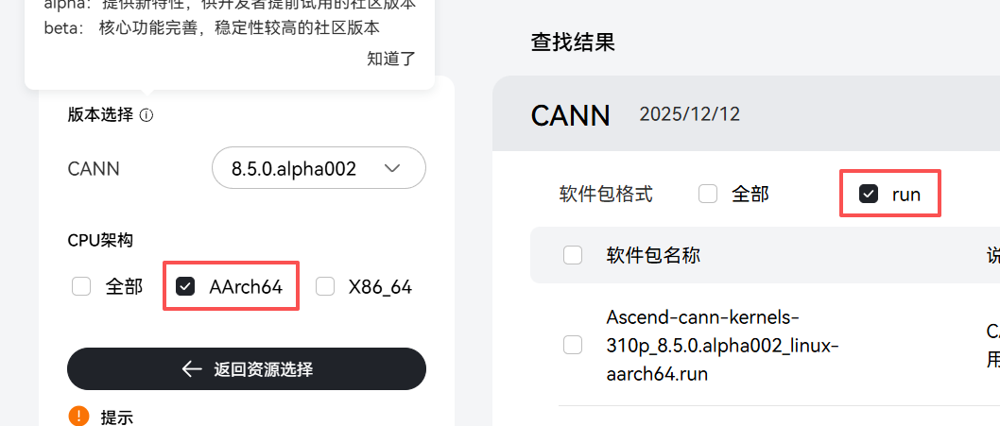
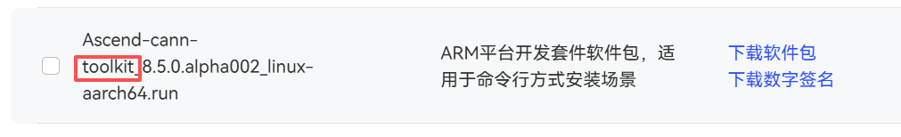
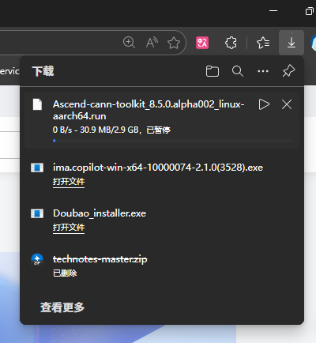
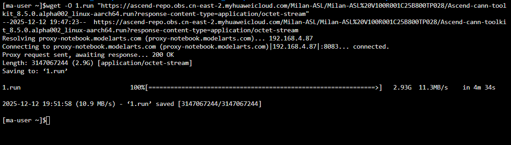

# 配置昇腾开发环境

## ## 一、背景 / 为什么要学这个？

昇腾（Ascend）AI处理器现在用得越来越多了，不管是做AI模型训练还是推理，都可能用到它。但说实话，第一次配它的开发环境还挺麻烦的——要装驱动、装CANN套件、配环境变量，一步不对可能就卡住了。

所以我就写了这篇文档，把配置的每一步都写清楚，配上命令和说明。目标很简单：让你照着做，就能把环境配好，少踩点坑，早点开始写你的AI代码。

## 二、环境准备

### 2.1 硬件背景

香橙派AIpro，（Ascend310B4），只有一个AICORE，算力8T

## 三、安装步骤详解

### 3.1 驱动下载与安装

#### 3.1.1官网上下载对应版本的toolkit工具包：[下载地址](https://www.hiascend.com/developer/download/community/result?module=cann&cann=8.5.0.alpha002)
 - 官网上找到对应文件

- 勾选设备的架构，软件包格式选择.run后缀的，架构可以根据下述指令获得
```bash
uname -m
```

- 找到带toolkit的包下载

- 如果在服务器上下载的话，可以先点击下载软件包

暂停下载后右击复制下载链接，之后在服务器终端输入
```bash
wget -O 输出文件名称（要带后缀） "下载链接"
```

```bash
wget _O 1.run "https://ascend-repo.obs.cn-east-2.myhuaweicloud.com/Milan-ASL/Milan-ASL%20V100R001C25B800TP028/Ascend-cann-toolkit_8.5.0.alpha002_linux-aarch64.run?response-content-type=application/octet-stream"
```
效果如图所示，可以直接将文件下载在服务器上。

#### 3.1.2工具包的安装
1. 赋予工具包执行权限
```bash
chmod +x 1.run
```
2. 安装
```bash
./1.run --install
```
除了安装之外还有升级
```bash
./1.run --upgrade
```
### 3.2 环境变量配置


## 四、环境验证

### 4.1 基础环境检查

- 使用`npu-smi`命令查看设备状态
- 检查驱动版本
- 验证CANN安装

### 4.2 运行示例程序

- 编译并运行简单的测试程序
- 验证AI处理器正常工作
- 常见问题排查

## 五、开发环境配置

### 5.1 IDE配置（如VSCode）

- 插件安装
- 调试环境配置
- 代码补全设置

### 5.2 容器环境（可选）

- Docker镜像获取
- 容器化开发环境搭建
- 优势与使用场景

## 六、常见问题与解决方案

- 驱动安装失败的处理
- 权限问题（如用户组添加）
- 版本兼容性问题
- 网络连接问题

## 七、最佳实践与建议

- 环境备份策略
- 版本管理建议
- 性能优化配置
- 安全注意事项

## 八、总结

- 环境配置要点回顾
- 后续学习路径建议
- 资源推荐（官方文档、社区等）

## 附录

- 常用命令速查表
- 官方资源链接
- 版本兼容性矩阵

